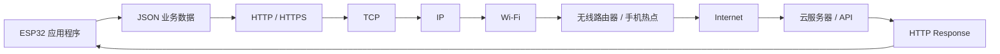
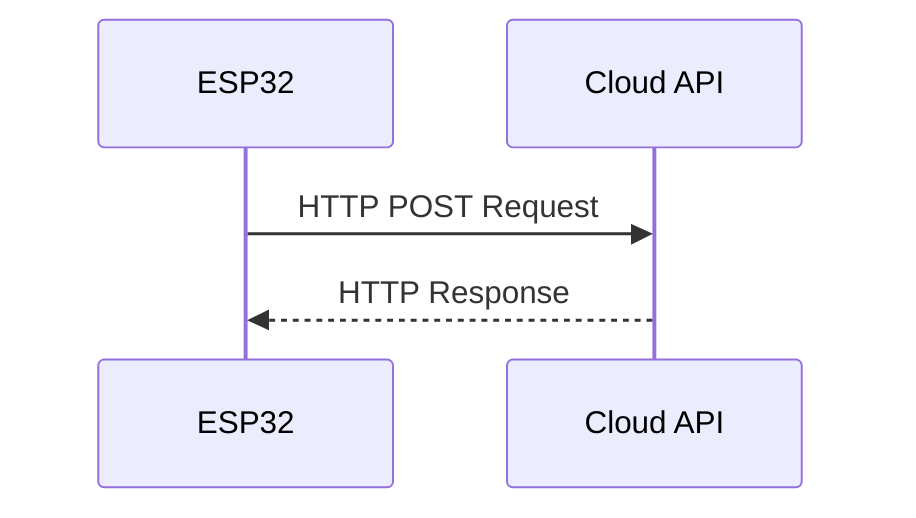

# 曼波机器狗：ESP32 链路文档v1

---

## 1. How to connect the Internet

联网链路收敛为以下最小路径：

```text
ESP32
  ↓
连接 Wi‑Fi
  ↓
获取 IP
  ↓
建立 TCP 连接
  ↓
透过 HTTP/HTTPS 发送请求
  ↓
云端接口接收数据
  ↓
返回 Response
  ↓
ESP32 解析结果
```

第一阶段先验证“ESP32 能稳定联网，并向一个云端接口发送一段数据，再收到返回值”。

语音、AI 对话、设备控制都可以建立在这条链路之上。

---

## 2. 整体链路



从应用层自顶向下看，可以先以下面顺序理解：

```text
JSON
 ↓
HTTP
 ↓
TLS（HTTPS 时）
 ↓
TCP
 ↓
IP
 ↓
Wi‑Fi
```

每一层只处理自己关心的问题。ESP32 应用最终看到的是“发送请求”和“收到响应”，底层的 Wi‑Fi、TCP/IP、TLS 等由 ESP-IDF 网络栈和相关组件配合完成。(类似网路7层结构)

---

## 3. Wi‑Fi

ESP32 在这个项目里可以工作在 **Station（STA）模式**，也就是像手机、电脑一样连接现有 Wi‑Fi。

基本流程：

```text
ESP32 启动
   ↓
初始化网络栈
   ↓
初始化 Wi-Fi Driver
   ↓
设置 STA 模式
   ↓
配置 SSID / Password
   ↓
连接 AP
   ↓
DHCP 获取 IP
```

Espressif 官方的 `wifi/getting_started/station` 示例就是最直接的参考。示例中透过 `menuconfig` 配置 SSID 和密码，连接成功后会打印类似：

```text
got ip: 192.168.x.x
```

拿到 IP 后，说明 ESP32 已经具备访问局域网和互联网的基础条件。

### 需关注之内容

- SSID / Password 配置
- Wi‑Fi 连接事件
- 断线重连
- DHCP 获取 IP
- 网络状态管理

---

## 4. IP

ESP32 连上 Wi‑Fi 后通常会从路由器获得一个局域网 IP，例如：

```text
ESP32: 192.168.1.23
```

云服务器也有自己的网络地址。

应用程序一般不会直接写服务器 IP，而是访问域名：

```text
api.example.com
```

此时会透过 **DNS（Domain Name System）** 解析，把域名转换成对应的 IP 地址。

```text
api.example.com
      ↓ DNS
34.xxx.xxx.xxx
```

因此完整一点的访问过程为：

```text
ESP32
 ↓
连接 Wi-Fi
 ↓
获得本机 IP
 ↓
DNS 查询服务器域名
 ↓
得到服务器 IP
 ↓
开始建立连接
```

---

## 5. TCP：建立连接

TCP 主要负责：

- 建立连接
- 数据按顺序交付
- 丢包后的重传
- 流量控制
- 拥塞控制

应用层通常只需要面对类似这样的概念：

```c
connect(...)
send(...)
recv(...)
```

从更底层看，TCP 会把一段应用数据拆成若干段发送，再在接收端重新组织。

### IP + Port

只知道服务器 IP 还不够，还需要知道服务对应的端口。

| 协议 | 常见端口 |
|---|---:|
| HTTP | 80 |
| HTTPS | 443 |
| SSH | 22 |

例如：

```text
34.xxx.xxx.xxx:443
```
想从 C 语言角度理解 Socket、IP、Port、TCP 的内容，参见: [Beej's Guide to Network Programming](https://beej-zhtw.netdpi.net/)

---

## 6. HTTP：ESP32 和云端如何表达一次请求

HTTP 是应用层协议，采用请求 / 响应模式。



比如机器狗准备上传一段文本：

```json
{
  "device": "mambo_dog",
  "text": "hello"
}
```

可以透过 HTTP POST 发送。

为了便于理解，一个 HTTP/1.1 请求可以写成：

```http
POST /api/chat HTTP/1.1
Host: api.example.com
Content-Type: application/json

{"device":"mambo_dog","text":"hello"}
```

服务器处理完成后返回：

```http
HTTP/1.1 200 OK
Content-Type: application/json

{"reply":"hello mambo"}
```

这里几个概念比较重要：

- `POST`：请求方法，这里用于向服务器提交数据
- `/api/chat`：接口路径
- `Host`：目标服务器
- `Content-Type: application/json`：说明 Body 中是 JSON
- `200 OK`：服务器成功处理请求
- Body：真正的业务数据

MDN 的 HTTP 概述和 HTTP Messages 两篇文档很适合快速补齐这部分基础, 参见: [面向开发者的Web技术](https://developer.mozilla.org/zh-CN/docs/Web/HTTP/Guides/Overview)

---

## 7. HTTPS / TLS：安全通信

真实云端 API 大多会使用：

```text
https://...
```

HTTPS 通信会使用 TLS 对传输内容进行保护。

在典型 HTTPS 流程里：

```text
TCP 连接建立
    ↓
TLS Handshake
    ↓
验证服务器证书
    ↓
协商加密参数 / 会话密钥
    ↓
开始加密 HTTP 数据
```

ESP-IDF 的 `esp_http_client` 支持 HTTP 和 HTTPS。HTTPS 场景下可以使用证书或 ESP x509 Certificate Bundle 做服务器验证。

这一块后续上板时需要重点确认：

- 服务器证书验证
- CA / Certificate Bundle
- 系统时间
- TLS 握手失败的错误处理
- 内存占用

目前阶段先知道 TLS 位于 HTTP 与底层网络连接之间即可。

---

## 8. JSON：机器狗与云端约定之数据格式

JSON 适合用来组织设备和云端之间的业务数据。

例如机器狗上传：

```json
{
  "device_id": "mambo_001",
  "type": "text",
  "content": "曼波"
}
```

云端返回：

```json
{
  "code": 0,
  "reply": "你好屌毛"
}
```

后续语音识别接入以后，链路可以扩展成：

```text
用户语音
   ↓
语音识别
   ↓
得到文字
   ↓
ESP32 组织 JSON
   ↓
HTTPS POST
   ↓
AI 云端
   ↓
返回 JSON
   ↓
ESP32 解析 reply
   ↓
交给后续语音输出模块
```

因此联网模块和语音模块之间可以先约定清晰的数据接口，联网层只负责把数据可靠地送到云端，并把返回结果交回业务层。

---

## 9. ESP-IDF 中对应哪些组件

后续真正开始写代码时，可以把前面的理论对应到 ESP-IDF：

| 需求 | ESP-IDF 中的方向 |
|---|---|
| Wi‑Fi 连接 | Wi‑Fi Driver / Station Example |
| 获取 IP | `esp_netif` / IP Event |
| DNS / TCP/IP | lwIP |
| HTTP/HTTPS | `esp_http_client` |
| TLS | ESP-TLS / mbedTLS |
| JSON | cJSON |
| 日志 | `ESP_LOGI / ESP_LOGE` |

### HTTP Client 的基本使用思路

Espressif 官方文档给出的基础流程可以概括为：

```text
esp_http_client_init()
        ↓
配置 URL / Method / Header / Body
        ↓
esp_http_client_perform()
        ↓
获取 Status Code / Response
        ↓
esp_http_client_cleanup()
```

对于 V1 来说，用 `esp_http_client` 做 HTTP/HTTPS 请求可以快速搭起最小闭环。

底层 Socket 仍然值得了解，因为它能帮助定位连接失败、DNS、端口、TCP 等网络问题。

---

## 12. 参考资料

### Espressif / ESP-IDF

- [ESP-IDF Get Started](https://docs.espressif.com/projects/esp-idf/en/stable/esp32/get-started/)
- [ESP-IDF Wi-Fi Station Example](https://github.com/espressif/esp-idf/tree/master/examples/wifi/getting_started/station)
- [ESP-IDF HTTP Request Example](https://github.com/espressif/esp-idf/tree/master/examples/protocols/http_request)
- [ESP HTTP Client 官方文档](https://docs.espressif.com/projects/esp-idf/en/stable/esp32/api-reference/protocols/esp_http_client.html)

### 网络 / HTTP

- [MDN：HTTP 概述](https://developer.mozilla.org/zh-CN/docs/Web/HTTP/Guides/Overview)
- [MDN：HTTP 消息](https://developer.mozilla.org/zh-CN/docs/Web/HTTP/Guides/Messages)
- [Beej's Guide to Network Programming](https://beej.us/guide/bgnet/)

### TLS

- [Cloudflare：What Happens in a TLS Handshake?](https://www.cloudflare.com/learning/ssl/what-happens-in-a-tls-handshake/)

---
